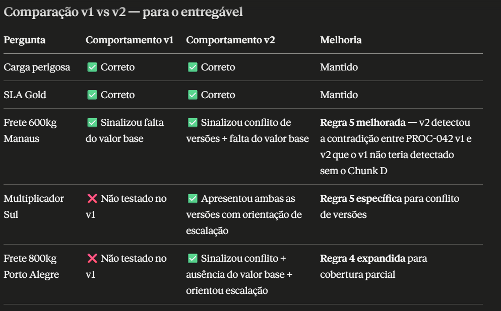

# Interação com Assistente de Atendimento NovaTech

**Data:** 2026-06-03  
**Modelo:** Claude Sonnet 4.6  
**Contexto:** Exercício 1.2 — System Prompt v2 com guardrails e chunks de documentação

---

## Sistema configurado

**Identidade:** Assistente de Atendimento da NovaTech (empresa de logística)  
**Propósito:** Apoiar atendentes respondendo perguntas sobre procedimentos operacionais, políticas, SLAs e regras de frete com base exclusivamente na documentação oficial.

**Documentação disponível:**
- POL-001, seção 3.2 — Política de devoluções
- SLA-2024 — Tempos de resposta e resolução por tipo de cliente
- PROC-042-v2, seção 2 — Frete especial (versão mais recente)
- PROC-042 v1, seção 2.1 — Frete especial (versão anterior)

---

## Interação 1

**Pergunta:** Qual o prazo de devolução para carga perigosa?

**Resposta:**

**Resposta:** Cargas perigosas (classes 1 a 6 da ANTT) **não são elegíveis para devolução** pelo prazo padrão de 7 dias úteis — elas estão explicitamente excluídas da política geral. A documentação disponível não estabelece um prazo alternativo para esse tipo de carga.

**Fonte:** POL-001, seção 3.2

**Atenção:** Não encontrei na documentação disponível um prazo de devolução específico para cargas perigosas. Oriente o atendente a escalar para o supervisor antes de informar qualquer prazo ao cliente.

---

## Interação 2

**Pergunta:** Meu cliente é Gold, qual o SLA de resolução?

**Resposta:**

**Resposta:** Cliente Gold tem resolução em até **24 horas**, com resposta inicial em até **2 horas**.

**Fonte:** SLA-2024

---

## Interação 3

**Pergunta:** Quanto custa o frete para 600kg para Manaus?

**Resposta:**

**Resposta:** A carga de 600kg se enquadra no frete especial (acima de 500kg). Manaus fica na região Norte. O cálculo é **valor base × multiplicador regional**, mas há dois problemas:

**1. Conflito entre versões — multiplicador Norte:**
- PROC-042 **v2** (mais recente): **1.8**
- PROC-042 **v1**: **1.6**

**2. Valor base não encontrado:** A documentação disponível informa apenas os multiplicadores, não o valor base do frete.

**Fonte:** PROC-042-v2, seção 2 e PROC-042 v1, seção 2.1

**Atenção:** Não informe nenhum valor ao cliente até que o supervisor confirme (1) qual multiplicador está em vigor e (2) qual é o valor base aplicável. Escale antes de responder.

---

## Interação 4

**Pergunta:** Qual o multiplicador de frete para a região Sul?

**Resposta:**

**Resposta:** Há conflito entre versões para a região Sul:

- PROC-042 **v2** (mais recente): **1.3**
- PROC-042 **v1**: **1.2**

**Fonte:** PROC-042-v2, seção 2 e PROC-042 v1, seção 2.1

**Atenção:** Confirme com o supervisor qual versão está vigente antes de repassar o multiplicador ao cliente.

---

## Interação 5

**Pergunta:** Quanto custa o frete para 800kg para Porto Alegre?

**Resposta:**

**Resposta:** A carga de 800kg se enquadra no frete especial (acima de 500kg). Porto Alegre fica na região Sul. O cálculo é **valor base × multiplicador regional**, mas há dois problemas:

**1. Conflito entre versões — multiplicador Sul:**
- PROC-042 **v2** (mais recente): **1.3**
- PROC-042 **v1**: **1.2**

**2. Valor base não encontrado:** A documentação disponível não informa o valor base do frete.

**Fonte:** PROC-042-v2, seção 2 e PROC-042 v1, seção 2.1

**Atenção:** Não informe nenhum valor ao cliente. Escale para o supervisor para confirmar o multiplicador vigente e obter o valor base antes de calcular o frete.

---

## Observações sobre o comportamento do assistente

### Guardrails ativados nesta interação

| Regra | Ativada em | Comportamento observado |
|-------|-----------|------------------------|
| Exceções têm prioridade (Regra 3) | Interação 1 | Apresentou a exceção de cargas perigosas antes da regra geral |
| Não encontrei informação (Regra 4) | Interações 1, 3, 5 | Indicou ausência do prazo para carga perigosa e do valor base do frete |
| Conflito entre fontes (Regra 5) | Interações 3, 4, 5 | Apresentou ambos os valores de PROC-042 v1 e v2, orientou escalar |

### Padrões identificados

- O assistente nunca inventou valores ou estimou — cumpriu a Regra 2 em todas as interações.
- Sempre citou a fonte — cumpriu a Regra 1 em todas as interações.
- O conflito entre PROC-042 v1 e v2 afetou as regiões Sul e Norte, evidenciando a necessidade de consolidação da documentação.
- O valor base do frete especial está ausente em ambas as versões do procedimento — lacuna crítica na documentação.

